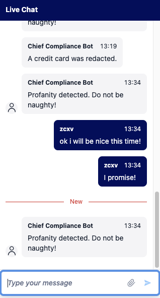
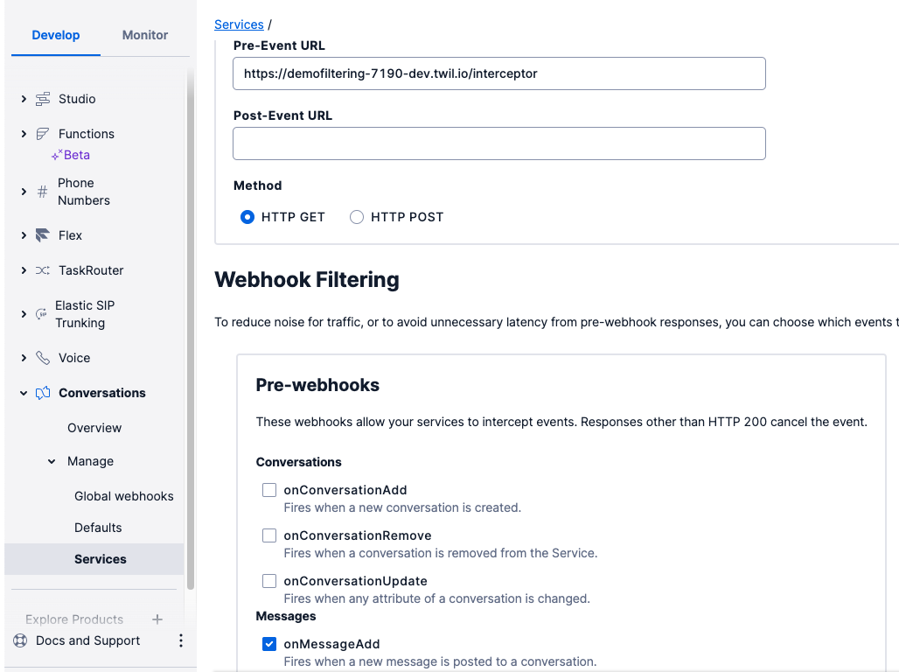

# Demo for intercepting messages in conversations

This repository demonstrates the ability to intercept messages in Conversations using the pre event weebhook. You can then apply rules such as profanity filters, removing credit card details, implementing FAQ/chatbot, capturing transcript for posterity. 

<p align="center">
    
</p>


## Development and Deployment

1. Clone this repository.
2. Populate .env file based on .env.example
3. Install dependencies.

```bash
npm install
```

4. Deploy the function to Twilio functions.

```bash
twilio serverless:deploy
```

5. Configure the conversation service pre event webhook with the URL of your Twilio function. Also check the onMessageAdd button. 

 

---

## Changelog


## Disclaimer
This software is to be considered "sample code", a Type B Deliverable, and is delivered "as-is" to the user. Twilio bears no responsibility to support the use or implementation of this software.